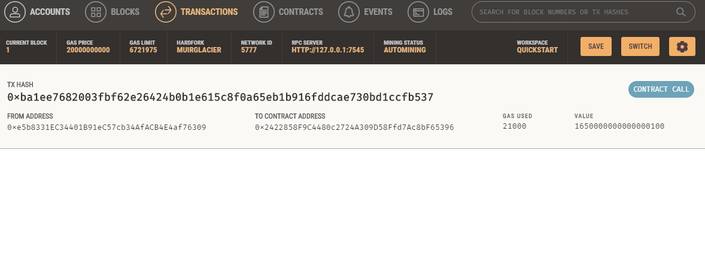
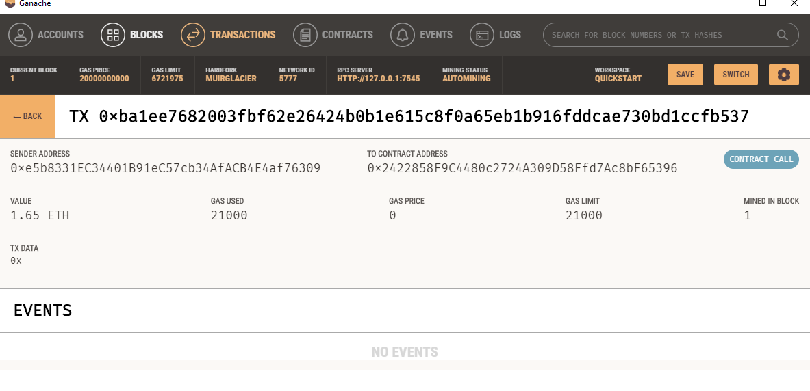
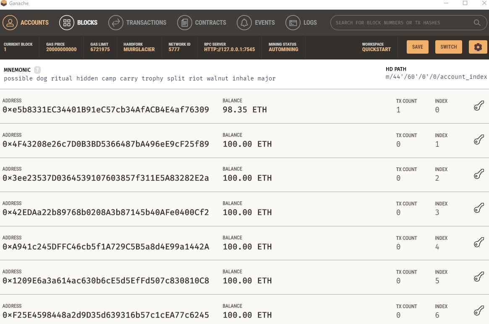

# Module 19 challenge

This a program that uses code to enable our customers to hire fintech professionals by sending them cryptocurrency.

This program is broken down by 2 essential files:
    - cryptocurrency wallet that handles the transferring and receiving of funds
    - fintech finder file that creates the decentralized web page and creates a smooth user interface

The streamlit app uses a simple process:
    -pick fintech propfessional that fits criteria for worka and desired rate
    -input desired time of work
    -confirm amount of eth required for transaction and send eth

Attached are pictures of the transaction that has been ran through ganache and the balances sent for required services. 

